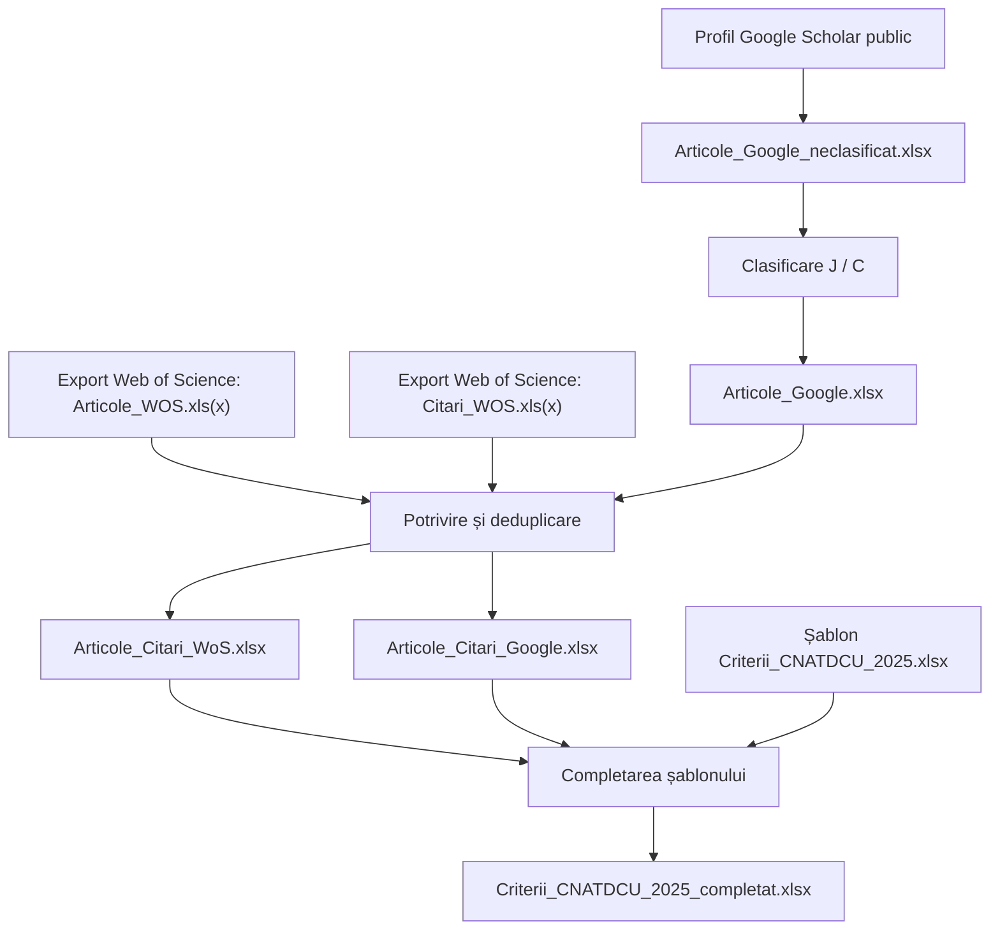

# Raportare articole și citări conform OMEC nr. 3019/2025

## Comisia 9 – Inginerie electrică

Proiect Jupyter Notebook pentru colectarea, clasificarea, eliminarea duplicatelor și introducerea articolelor și citărilor într-un șablon de raportare compatibil cu fluxul de lucru asociat Ordinului ministrului educației și cercetării nr. 3.019/2025.

> **Stadiu: testare și validare.** Proiectul poate produce rezultate incomplete sau clasificări greșite. Toate fișierele intermediare sunt păstrate pentru audit și corectare. Verificați manual fiecare articol, citare, categorie, formulă și punctaj înainte de utilizare oficială.

## Cui i se adresează

Proiectul este destinat cercetătorilor care doresc să-și centralizeze publicațiile și citările din Google Scholar și Web of Science. Ca recomandare practică, profilurile cu indice Hirsch Google Scholar sub 20 se pot încadra adesea în limita planului gratuit SerpApi, dar indicele Hirsch nu determină direct numărul de interogări. Consumul real depinde de numărul de publicații, citări și pagini de rezultate.

La data ultimei verificări, 15 iulie 2026:

- planul SerpApi Free include 250 de căutări/lună;
- planul Starter este listat la 25 USD/lună pentru 1.000 de căutări, nu la 25 EUR; cursul valutar și taxele pot modifica suma achitată.

Verificați întotdeauna [pagina oficială SerpApi Pricing](https://serpapi.com/pricing) înainte de a cumpăra un plan.

## Ce realizează proiectul



Fluxul:

1. extrage articolele și citările din profilul Google Scholar prin SerpApi;
2. completează metadate bibliografice prin Crossref, când potrivirea este suficient de sigură;
3. salvează checkpointuri, jurnal de progres și rezultat parțial;
4. clasifică fiecare înregistrare ca jurnal (J) sau conferință (C);
5. corelează exporturile Google cu articolele și citările WoS;
6. creează două registre cu intrări unice, WoS având prioritate;
7. completează categoriile 2.1.a, 2.1.b, 2.2.a, 2.2.b, 3.1.a și 3.1.b;
8. păstrează și validează formulele și sumele șablonului.

## Pornire rapidă

### 1. Descărcarea proiectului

```bash
git clone ADRESA_REPOSITORY-ULUI
cd raportare-omec-3019-2025-comisia-9
```

Puteți descărca și arhiva ZIP din GitHub: **Code → Download ZIP**, apoi o extrageți într-un director propriu.

### 2. Crearea mediului

Din Anaconda Prompt:

```bash
conda env create -f environment.yml
conda activate raportare-omec-3019
jupyter lab
```

Alternativ:

```bash
python -m pip install -r requirements.txt
jupyter notebook
```

### 3. Pregătirea intrărilor

Copiați în `data/input/`:

- `Articole_WOS.xls` sau `Articole_WOS.xlsx`;
- `Citari_WOS.xls` sau `Citari_WOS.xlsx`;
- `Criterii_CNATDCU_2025.xlsx`, șablonul dumneavoastră de raportare.

Nu redenumiți foile și categoriile din șablon. Nu publicați aceste fișiere pe GitHub fără a verifica drepturile de reutilizare și datele personale.

### 4. Configurarea secretelor

Copiați `.env.example` ca `.env` și adăugați cheia, sau introduceți cheia mascat în notebook:

```text
SERPAPI_API_KEY=cheia_personala
CROSSREF_MAILTO=adresa_email_pentru_polite_pool
```

Fișierul `.env` este ignorat de Git. Nu scrieți cheia API în notebook, în capturi de ecran, în issue-uri sau în commituri.

### 5. Rularea

Deschideți `Raportare_OMEC_3019_2025.ipynb` și utilizați **Kernel → Restart Kernel and Run All Cells**. Pentru control și verificare, se recomandă rularea celulelor pe rând.

## Fișiere generate

Fișierele sunt salvate separat, astfel încât fiecare etapă să poată fi inspectată:

| Director | Fișier | Rol |
|---|---|---|
| `data/intermediate` | `Articole_Google_neclasificat.xlsx` | export brut și checkpoint Google Scholar |
| `data/intermediate` | `Articole_Google_neclasificat.log` | jurnal cronologic |
| `data/intermediate` | `Articole_Google_neclasificat.status.json` | stare pentru diagnostic și reluare |
| `data/intermediate` | `Articole_Google.xlsx` | export cu tip J/C |
| `data/output` | `Articole_Citari_WoS.xlsx` | articole și citări WoS unice |
| `data/output` | `Articole_Citari_Google.xlsx` | articole și citări Google rămase |
| `data/output` | `Criterii_CNATDCU_2025_completat.xlsx` | raportul final |

Cache-ul din `data/cache/google_scholar` permite reluarea. Pentru o colectare complet nouă, utilizați parametrul `FORCE_REFRESH = True` numai după ce ați arhivat rezultatele anterioare.

## Structura depozitului

```text
.
├── Raportare_OMEC_3019_2025.ipynb
├── README.md
├── environment.yml
├── requirements.txt
├── .env.example
├── scripts/
│   ├── google_scholar_export.py
│   ├── classifica_articole.py
│   ├── construieste_articole_citari_wos.py
│   ├── completeaza_criterii_cnatdcu.py
│   └── pipeline.py
├── data/
│   ├── input/
│   ├── intermediate/
│   ├── output/
│   └── cache/
├── docs/
│   ├── GHID_UTILIZARE.md
│   ├── EXPORT_WEB_OF_SCIENCE.md
│   └── SURSE_SI_LIMITARI.md
└── tests/
```

## Documentație

- [Ghid complet de instalare și utilizare](docs/GHID_UTILIZARE.md)
- [Exportarea articolelor și citărilor din Web of Science](docs/EXPORT_WEB_OF_SCIENCE.md)
- [Surse, ipoteze și limitări](docs/SURSE_SI_LIMITARI.md)
- [Publicarea proiectului pe GitHub](docs/PUBLICARE_GITHUB.md)
- [Declinarea răspunderii](DISCLAIMER.md)
- [Confidențialitate și protecția datelor](PRIVACY.md)
- [Securitate](SECURITY.md)
- [Contribuții](CONTRIBUTING.md)

## Cerințe de verificare manuală

Înainte de raportare:

- comparați numărul publicațiilor din profil cu fișierul Google;
- verificați toate rândurile J/C, mai ales denumirile cu paranteze;
- confirmați DOI, ISSN/eISSN, an, volum, număr și pagini;
- confirmați că fiecare citare este asociată articolului corect;
- verificați autocitările și orice excludere cerută de regulament;
- verificați indexarea WoS/IEEE Xplore și clasificarea BDI la data relevantă;
- căutați duplicate după DOI și după titlu normalizat;
- completați valoarea factorului de impact la revistele din categoria 2.1.a (Factorul de impact al revistei, menționat pe site-ul WOS (Web of Science) în anul publicării articolului sau în anul curent (candidatul alege cea mai favorabilă situație); pentru articolele în conference proceedings indexate WOS și pentru brevetele indexate WOS-Derwent, factorul de impact considerat va fi egal cu zero.)
- verificați daca articolele BDI sunt clasificate Scopus, aceasta bază de date a fost utilizată implicit pentru că este cea mai cuprinzătoare (Bazele de date internaționale (BDI) luate în considerare pentru articolele publicate în reviste și în volumele unor manifestări științifice sunt: Scopus, IEEE Xplore, ScienceDirect, Elsevier, Wiley, ACM, DBLP, SpringerLink, Engineering Village, CABI, Emerald, CSA, Compendex, IET Inspec, EBSCO, ProQuest, Index Copernicus, Ulrichsweb, DOAJ.)
- deschideți raportul în Microsoft Excel și recalculați formulele;
- comparați punctajele cu forma oficială și actualizată a OMEC nr. 3019/2025 și cu regulile instituției.

## Cadrul normativ

Referința oficială este [Ordinul nr. 3.019 din 13 ianuarie 2025 – Portal Legislativ](https://legislatie.just.ro/Public/DetaliiDocumentAfis/294663). Proiectul nu înlocuiește ordinul, anexele sale, rectificările, interpretarea instituției sau evaluarea comisiei.

## Licențiere

- codul software este oferit sub licența MIT și, suplimentar, sub CC BY 4.0;
- documentația, notebookul și materialele originale sunt oferite sub [Creative Commons Attribution 4.0 International](https://creativecommons.org/licenses/by/4.0/);
- exporturile WoS, datele Google Scholar, șablonul instituțional și alte materiale terțe nu sunt relicențiate de acest proiect și rămân supuse drepturilor și termenilor titularilor lor.

Creative Commons nu recomandă în general licențele CC pentru software; de aceea licența MIT este licența software principală. Consultați `LICENSE`, `LICENSE-CC-BY-4.0.md` și `NOTICE.md`.

## Declinarea răspunderii

Proiectul este furnizat „ca atare”, fără garanții. Autorul/dezvoltatorul nu își asumă răspunderea pentru erori, omisiuni, date incomplete, costuri API, pierderi, respingerea unui dosar sau orice consecințe directe ori indirecte. Utilizarea nu creează obligații legale, contractuale, profesionale sau fiduciare pentru autor. Folosiți proiectul pe propriul risc și validați rezultatele cu sursele oficiale și persoanele competente.

Proiectul nu este afiliat, aprobat sau sponsorizat de Google, Google Scholar, SerpApi, Crossref, Clarivate, Web of Science, E-nformation, Ministerul Educației și Cercetării ori CNATDCU. Denumirile și mărcile aparțin titularilor lor.
